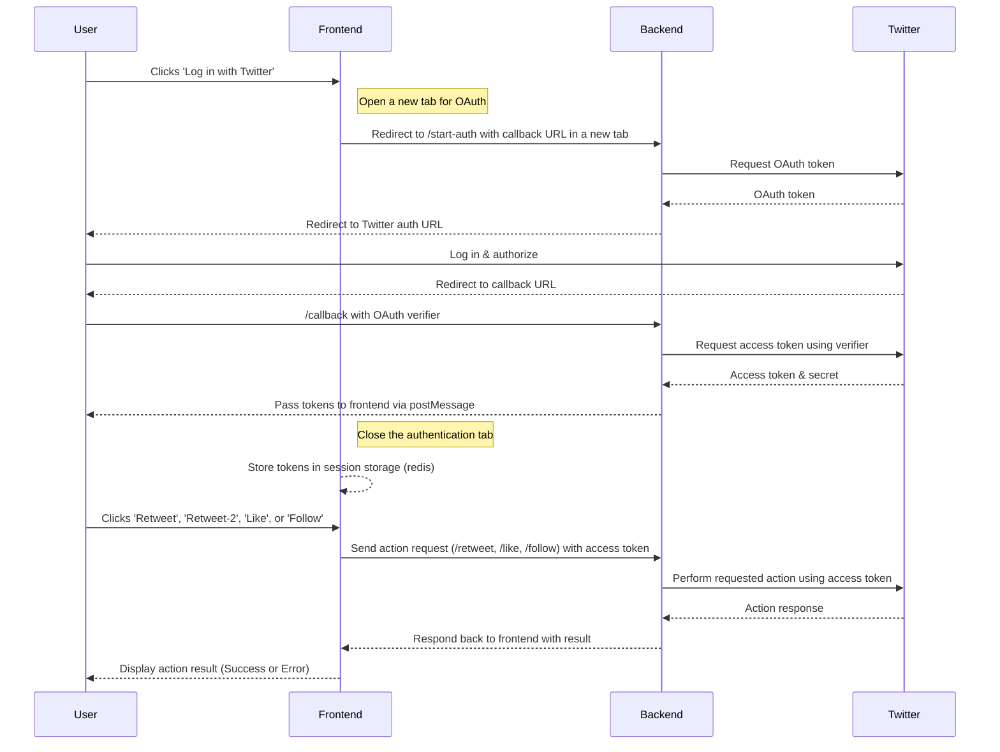
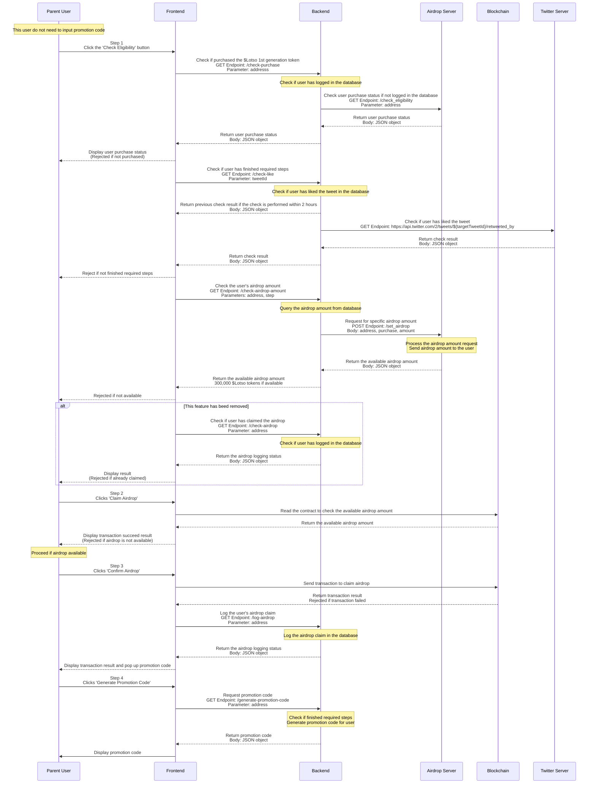
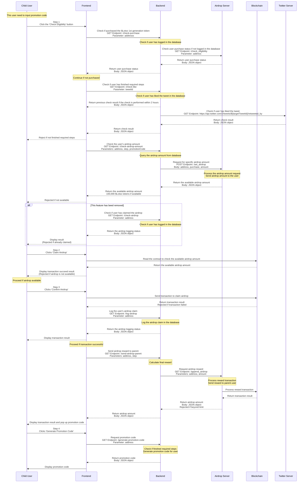

# Twitter OAuth Docker Project

[](https://github.com/BTI-US/Lotso-Twitter-Auth/actions/workflows/docker-ci.yml)
[](https://github.com/BTI-US/Lotso-Twitter-Auth/actions/workflows/codeql.yml)
[](https://github.com/BTI-US/Lotso-Twitter-Auth/actions/workflows/reviewdog.yml)
[](https://opensource.org/licenses/MIT)

- Last Modified: 2024-12-24
- Author: Phill Weston

## Table of Contents

- [Twitter OAuth Docker Project](#twitter-oauth-docker-project)
  - [Table of Contents](#table-of-contents)
  - [Overview](#overview)
  - [Features](#features)
  - [Requirements](#requirements)
  - [Diagram](#diagram)
    - [Twitter OAuth Sequence Diagram](#twitter-oauth-sequence-diagram)
      - [Steps for Twitter OAuth (Frontend)](#steps-for-twitter-oauth-frontend)
    - [Airdrop Sequence Diagram](#airdrop-sequence-diagram)
      - [Parent User: (This user claims the airdrop and shares the promotion code)](#parent-user-this-user-claims-the-airdrop-and-shares-the-promotion-code)
      - [Explanation of this Parent User Diagram](#explanation-of-this-parent-user-diagram)
      - [Child User: (This user uses the promotion code shared by the parent user to claim the airdrop)](#child-user-this-user-uses-the-promotion-code-shared-by-the-parent-user-to-claim-the-airdrop)
      - [Explanation of this Child User Diagram](#explanation-of-this-child-user-diagram)
    - [Additional Details](#additional-details)
  - [Installation and Setup](#installation-and-setup)
    - [Setting Up Twitter API Keys](#setting-up-twitter-api-keys)
    - [Building the Docker Image](#building-the-docker-image)
    - [Building the MongoDB Docker Image](#building-the-mongodb-docker-image)
    - [Building the Redis Docker Image](#building-the-redis-docker-image)
    - [Setting the docker network](#setting-the-docker-network)
  - [Running the Application](#running-the-application)
  - [Swagger API Explanations](#swagger-api-explanations)
  - [How to Write a Swagger Annotation](#how-to-write-a-swagger-annotation)
  - [How to Acquire Twitter API Keys](#how-to-acquire-twitter-api-keys)
  - [Twitter API Rate Limitations](#twitter-api-rate-limitations)
    - [User Authentication Settings](#user-authentication-settings)
  - [REST API Endpoints](#rest-api-endpoints)
  - [Return Code](#return-code)
  - [Milestones](#milestones)
  - [License](#license)

## Overview
This project implements a serverless function hosted within a Docker container to facilitate the OAuth authentication of Twitter users and enable interaction with Twitter's API directly from the frontend. The application allows users not only to check their tweets but also to engage with them by performing actions such as retweeting, liking, and sharing directly through the application.

## Features
- OAuth authentication with Twitter.
- Fetching tweets from authenticated user's timeline.
- Checking if any tweet contains specified content.

## Requirements
- [Node.js](https://nodejs.org/)
- [Docker](https://www.docker.com/)
- Twitter Developer Account and API keys (Consumer Keys Only).

## Diagram

### Twitter OAuth Sequence Diagram

- **User (U)**: The end-user interacting with the frontend.
- **Frontend (F)**: Your web application's frontend that interacts with the user and the backend.
- **Backend (B)**: The server-side component that handles OAuth with Twitter, fetching tweets, and analyzing content.
- **Twitter (T)**: The Twitter platform that handles OAuth and provides access to user tweets.



#### Steps for Twitter OAuth (Frontend)

1. **User Action**: The user clicks 'Log in with Twitter' on the frontend.
2. **OAuth Start**: The frontend opens a new tab redirecting the user to the backend `/start-auth` endpoint with the callback URL.
3. **OAuth Token Request**: The backend requests an OAuth token from Twitter.
4. **Twitter Response**: Twitter returns an OAuth token to the backend.
5. **User Redirect to Twitter**: The backend redirects the user to the Twitter authentication URL in the newly opened tab.
6. **User Authorizes**: The user logs into Twitter and authorizes the application.
7. **Callback to Backend**: Twitter redirects the user back to the specified callback URL on the backend, providing an OAuth verifier.
8. **Access Token Request**: The backend requests an access token from Twitter using the verifier.
9. **Twitter Provides Tokens**: Twitter sends the access token and secret back to the backend.
10. **Token Passing**: The backend passes the tokens to the frontend via `postMessage`, and the popup window is closed.
11. **Token Storage**: The frontend securely stores the tokens in session storage.
12. **User Actions**: The user performs actions such as 'Retweet', 'Like', or 'Share' via the frontend interface.
13. **Action Requests**: The frontend sends requests to the backend to perform the selected actions using the stored access tokens.
14. **Twitter Action Execution**: The backend makes API calls to Twitter to execute the actions (retweet, like, share).
15. **Display Results**: The frontend displays the results of the actions to the user (success or failure).

### Airdrop Sequence Diagram

#### Parent User: (This user claims the airdrop and shares the promotion code)

- **User (U)**: The end-user interacting with the frontend.
- **Frontend (F)**: The user interface that interacts with the user and the backend.
- **Backend (B)**: The server-side component that handles user eligibility, airdrop claims, and promotion code generation.
- **Airdrop Server (S)**: The server that manages airdrop rewards and logging.
- **Blockchain (BC)**: The blockchain network that processes airdrop transactions.
- **Twitter Server (T)**: The server that checks user Twitter interactions.



#### Explanation of this Parent User Diagram

Based on the selected Mermaid sequence diagram, here's the step-by-step process for the Parent User to claim the airdrop and share the promotion code:

1. **User Action**: The Parent User completes the required steps and clicks 'Check Eligibility' on the Frontend.
2. **Eligibility Check**: The Frontend sends a GET request to the Backend `/check-purchase` endpoint with the user's address as a parameter.
3. **Backend Processing**: The Backend checks if the user has purchased the $Lotso 1st generation token.
4. **Airdrop Server Query**: If the purchase status is not logged in the database, the Backend sends a GET request to the Airdrop Server `/check_eligibility` endpoint with the user's address as a parameter.
5. **Eligibility Status**: The Airdrop Server returns the purchase status to the Backend, which then forwards it to the Frontend.
6. **Display Result**: The Frontend displays the purchase status to the user. If the user has not purchased, the process ends here.
7. **Promotion Code Request**: If the user has purchased, the user clicks 'Generate Promotion Code', and the Frontend sends a GET request to the Backend `/generate-promotion-code` endpoint with the user's address as a parameter.
8. **Promotion Code Generation**: The Backend checks if the user has finished the required steps and generates a promotion code for the user, then returns it to the Frontend.
9. **Display Promotion Code**: The Frontend displays the promotion code to the user.
10. **User Shares Code**: If the user is eligible, they share the promotion code.
11. **Airdrop Verification**: The user clicks 'Claim Airdrop', and the Frontend sends a GET request to the Backend `/check-airdrop-amount` endpoint with the user's address and step as parameters.
12. **Airdrop Calculation**: The Backend queries the airdrop amount from the database.
13. **Airdrop Amount Query**: The Backend returns the available airdrop amount to the Frontend.
14. **Airdrop Determination**: The Frontend reads the contract from the Blockchain to check the available airdrop amount.
15. **Display Airdrop Amount**: The Frontend displays the airdrop amount to the user.
16. **Airdrop Confirmation**: The user clicks 'Confirm Airdrop', and the Frontend sends a transaction to the Blockchain to claim the airdrop.
17. **Final Reward Calculation**: The Blockchain returns the transaction result to the Frontend.
18. **Airdrop Reward Request**: The Frontend displays the transaction result and a promotion code to the user.
19. **Reward Transaction Processing**: The user clicks 'Claim Airdrop', and the Frontend logs the user's airdrop claim by sending a GET request to the Backend `/log-airdrop` endpoint with the user's address as a parameter.
20. **Airdrop Reward Delivery**: The Backend logs the airdrop claim in the database and returns the airdrop logging status to the Frontend, which then displays the transaction success result to the user.

#### Child User: (This user uses the promotion code shared by the parent user to claim the airdrop)

- **User (U)**: The end-user interacting with the frontend.
- **Frontend (F)**: The user interface that interacts with the user and the backend.
- **Backend (B)**: The server-side component that handles user eligibility, airdrop claims, and promotion code generation.
- **Airdrop Server (S)**: The server that manages airdrop rewards and logging.
- **Blockchain (BC)**: The blockchain network that processes airdrop transactions.
- **Twitter Server (T)**: The server that checks user Twitter interactions.



#### Explanation of this Child User Diagram

Based on the selected Mermaid sequence diagram, here's the step-by-step process for the Child User to claim the airdrop using the promotion code shared by the Parent User:

1. **User Action**: The Child User completes the required steps and clicks 'Check Eligibility' on the Frontend.
2. **Eligibility Check**: The Frontend sends a GET request to the Backend `/check-purchase` endpoint with the user's address as a parameter.
3. **Backend Processing**: The Backend checks if the user has purchased the $Lotso 1st generation token. If the purchase status is not logged in the database, the Backend sends a GET request to the Airdrop Server `/check_eligibility` endpoint with the user's address as a parameter.
4. **Airdrop Server Query**: The Airdrop Server returns the purchase status to the Backend, which then forwards it to the Frontend.
5. **Display Result**: The Frontend continues if the user has not purchased. It then sends a GET request to the Backend `/check-like` endpoint with the tweetId as a parameter.
6. **Twitter Server Check**: The Backend checks if the user has liked the tweet. If the check is performed within 2 hours, the Backend returns the previous check result. Otherwise, it sends a GET request to the Twitter Server to check if the user has liked the tweet.
7. **Display Result**: The Backend returns the check result to the Frontend, which then rejects the user if they have not finished the required steps.
8. **Airdrop Amount Check**: The Frontend sends a GET request to the Backend `/check-airdrop-amount` endpoint with the user's address, step, and promotion code as parameters. The Backend queries the airdrop amount from the database and returns the available airdrop amount to the Frontend.
9. **Display Result**: The Frontend rejects the user if the airdrop is not available. Otherwise, it sends a GET request to the Backend `/check-airdrop` endpoint with the user's address as a parameter to check if the user has claimed the airdrop.
10. **Airdrop Claim Check**: The Backend checks if the user has logged in the database and returns the airdrop logging status to the Frontend, which then displays the result to the user.
11. **User Action**: If the airdrop is available, the user clicks 'Claim Airdrop'. The Frontend reads the contract from the Blockchain to check the available airdrop amount.
12. **Airdrop Amount Check**: The Blockchain returns the available airdrop amount to the Frontend, which then rejects the user if the airdrop is not available.
13. **Airdrop Claim Log**: The Frontend logs the user's airdrop claim by sending a GET request to the Backend `/log-airdrop` endpoint with the user's address as a parameter. The Backend logs the airdrop claim in the database and returns the airdrop logging status to the Frontend.
14. **Display Result**: The Frontend displays the transaction success result to the user.
15. **User Action**: If the transaction is successful, the user clicks 'Confirm Airdrop'. The Frontend sends a transaction to the Blockchain to claim the airdrop.
16. **Transaction Result**: The Blockchain returns the transaction result to the Frontend, which then displays the transaction result to the user.
17. **Airdrop Reward Request**: If the transaction is successful, the Frontend sends a GET request to the Backend `/send-airdrop-parent` endpoint with the user's address and step as parameters. The Backend calculates the final reward and sends a GET request to the Airdrop Server `/append_airdrop` endpoint with the user's address and final reward amount as parameters.
18. **Reward Transaction Processing**: The Airdrop Server processes the reward transaction and sends the reward to the parent user. It then processes the reward transaction on the Blockchain and returns the transaction result to the Backend.
19. **Display Result**: The Backend returns the airdrop amount to the Frontend, which then displays the transaction result and a promotion code to the user.
20. **User Action**: The user clicks 'Generate Promotion Code'. The Frontend sends a GET request to the Backend `/generate-promotion-code` endpoint with the user's address as a parameter.
21. **Promotion Code Generation**: The Backend checks if the user has finished the required steps and generates a promotion code for the user, then returns it to the Frontend.
22. **Display Promotion Code**: The Frontend displays the promotion code to the user.

### Additional Details

- **Secure Token Handling**: The tokens are never exposed directly in the frontend code or stored insecurely. They are only transmitted using secure methods and stored temporarily as needed for making API requests.
- **User Interaction and Experience**: The use of a popup window for OAuth ensures that the user does not navigate away from the original application, improving the user experience by keeping the context intact.
- **Action Specificity**: By specifying that the user can perform actions such as retweeting, liking, and sharing directly after authentication, the steps reflect a more interactive and dynamic use of the Twitter API.
- **Backend and Frontend Roles**: The delineation between backend and frontend responsibilities is made clear, emphasizing security and efficient data handling.

## Installation and Setup

### Setting Up Twitter API Keys

1. Create a Twitter Developer account and an application to obtain your API keys.
2. Set your `TWITTER_CONSUMER_KEY` and `TWITTER_CONSUMER_SECRET` as environment variables or securely store them for use in the application.

### Building the Docker Image

1. Clone the repository:
   ```bash
   git clone https://github.com/BTI-US/Lotso-Twitter-Auth
   cd Lotso-Twitter-Auth
   ```
2. Build the Docker image:
   ```bash
   docker build -t twitter-auth .
   ```

### Building the MongoDB Docker Image

1. Pull the MongoDB image:
   ```bash
   docker pull mongo
   ```
2. Run the docker image with the necessary environment variables:
   ```bash
   docker run --name mongodb -d -p 27017:27017 -v /root/mongodb:/data/db -e MONGO_INITDB_ROOT_USERNAME=admin -e MONGO_INITDB_ROOT_PASSWORD=password mongo
   ```

### Building the Redis Docker Image

1. Pull the Redis image:
   ```bash
   docker pull redis
   ```
2. Run the docker image with the necessary environment variables:
   ```bash
   docker run --name redis -d -p 6379:6379 redis
   ```

### Setting the docker network

We need to create a docker network to allow the containers to communicate with each other. Run the following command:
```bash
docker network create lotso-network
```

## Running the Application

Run the service in non-Docker mode using the following command:
```bash
npm install
node src/start.js
```

Run the Docker container using the following command:
```bash
IMG_NAME=lotso-twitter-auth-main \
SERVER_PORT=5000 \
MONGODB_DB=twitterLogs \
MONGODB_USERDB=twitterUsers \
MONGODB_PORT=27017 \
MONGODB_USERNAME=admin \
MONGODB_PASSWORD='your_mongodb_password' \
TWITTER_CONSUMER_KEY='your_twitter_consumer_key' \
TWITTER_CONSUMER_SECRET='your_twitter_consumer_secret' \
CERT_PATH=/etc/ssl/certs/fullchain2.pem \
PRIVKEY_PATH=/etc/ssl/certs/privkey2.pem \
HOST_CERT_FOLDER=/etc/letsencrypt/archive/btiplatform.com \
CONTAINER_CERT_FOLDER=/etc/ssl/certs \
MONGODB_PATH=/root/mongodb-main \
REDIS_PORT=6000 \
AIRDROP_SERVER_PORT=8081 \
AIRDROP_PER_STEP=100000 \
AIRDROP_PER_PERSON=50000 \
AIRDROP_REWARD_AMOUNT=10000 \
LOTSO_PURCHASED_USER_AMOUNT=300000 \
WEBPAGE_ADDRESS=https://lotso.org \
AUTH_WEB_ADDRESS=https://api.btiplatform.com \
DOCKER_NETWORK=lotso-main-network \
CHECK_RETWEET_ENABLED=true \
CHECK_TWEET_ENABLED=true \
CHECK_LIKE_ENABLED=true \
docker-compose up -p main -d
```

To remove the Docker container, run:
```bash
IMG_NAME=lotso-twitter-auth-main \
SERVER_PORT=5000 \
MONGODB_DB=twitterLogs \
MONGODB_USERDB=twitterUsers \
MONGODB_PORT=27017 \
MONGODB_USERNAME=admin \
MONGODB_PASSWORD='your_mongodb_password' \
TWITTER_CONSUMER_KEY='your_twitter_consumer_key' \
TWITTER_CONSUMER_SECRET='your_twitter_consumer_secret' \
CERT_PATH=/etc/ssl/certs/fullchain2.pem \
PRIVKEY_PATH=/etc/ssl/certs/privkey2.pem \
HOST_CERT_FOLDER=/etc/letsencrypt/archive/btiplatform.com \
CONTAINER_CERT_FOLDER=/etc/ssl/certs \
MONGODB_PATH=/root/mongodb-main \
REDIS_PORT=6000 \
AIRDROP_SERVER_PORT=8081 \
AIRDROP_PER_STEP=100000 \
AIRDROP_PER_PERSON=50000 \
AIRDROP_REWARD_AMOUNT=10000 \
LOTSO_PURCHASED_USER_AMOUNT=300000 \
WEBPAGE_ADDRESS=https://lotso.org \
AUTH_WEB_ADDRESS=https://api.btiplatform.com \
DOCKER_NETWORK=lotso-main-network \
CHECK_RETWEET_ENABLED=true \
CHECK_TWEET_ENABLED=true \
CHECK_LIKE_ENABLED=true \
docker-compose -p main down
```

## Swagger API Explanations

This project uses the Swagger API to document the REST API endpoints. The Swagger API documentation can be accessed at the following URL:

[https://{YOUR_SERVER_IP_ADDRESS}:{YOUR_SERVER_PORT}/api-docs](https://{YOUR_SERVER_IP_ADDRESS}:{YOUR_SERVER_PORT}/api-docs)

## How to Write a Swagger Annotation

To add a new endpoint to the Swagger API documentation, follow these steps:

1. **Locate the Endpoint Definition**: Open the file where the endpoint is defined. This is typically a controller or route file in your project.
2. **Add the Swagger Annotation**: Above the endpoint definition, add a Swagger annotation. Swagger annotations are written as comments in a specific format that Swagger understands.
3. **Define the Path and Method**: Specify the path and HTTP method for the endpoint.
4. **Add Tags**: Tags help organize the endpoints in the Swagger UI. Add a `tags` section to categorize the endpoint.
5. **Provide a Summary and Description**: Add a brief summary and a detailed description of what the endpoint does.
6. **List the Parameters**: If the endpoint accepts parameters, list them under the `parameters` section. Specify the parameter location (`in`), name, schema type, whether it is required, and a description.
7. **Define the Responses**: Specify the possible responses from the endpoint, including status codes and descriptions.
8. **Save and Verify**: Save the file and restart your server if necessary. Open your Swagger UI to verify that the new endpoint is documented correctly.

## How to Acquire Twitter API Keys

1. Go to the [Twitter Developer Portal](https://developer.twitter.com/en/portal/dashboard).
2. Click on 'Projects & Apps' and then 'Overview'.
3. Click on 'Create App'.
4. Fill in the required details and create the app.
5. Go to the 'Keys and Tokens' tab.
6. Copy the 'API Key' and 'API Secret Key' and use them as your `TWITTER_CONSUMER_KEY` and `TWITTER_CONSUMER_SECRET`.

## Twitter API Rate Limitations

Refer to the [Twitter API Rate Limiting](https://developer.twitter.com/en/docs/twitter-api/rate-limits) documentation for details on the rate limits for different endpoints.

### User Authentication Settings

1. Click the 'Edit' button in the 'User Authentication Settings' section.
2. In the `App permission` field, select 'Read and write'.
3. In the `Type of App` field, select 'Web App, Automated App or Bot'.
4. In the `App info` field, set the `Callback URL / Redirect URL` to `https://api.btiplatform.com/twitter-callback`, and set the `Website URL` to `https://lotso.org`.
5. Click 'Save'.

## REST API Endpoints

The application has the following endpoints:
- `/start-auth`: Initiates the OAuth process.
- `/twitter-callback`: Handles the callback from Twitter and exchanges the request token for an access token.
- `/retweet`: Retweets a specific tweet.
- `/like`: Likes a specific tweet.
- `/bookmark`: Bookmarks a specific tweet.
- `/follow-us`: Follows a specific user.
- `/check-auth-status`: Checks if the user is authenticated.
- `/check-retweet`: Checks if a tweet has been retweeted by the user.
- `/check-like`: Checks if a tweet has been liked by the user.
- `/check-follow`: Checks if a user is following the specified account.
- `/check-bookmark`: Checks if a tweet has been bookmarked by the user.
- `/check-airdrop`: Checks if user has claimed an airdrop.
- `/log-airdrop`: Logs the airdrop claim.
- `/check-airdrop-amount`: Checks the amount of airdrop available for the user.
- `/generate-promotion-code`: Generates a promotion code for the user.
- `/send-airdrop-parent`: Sends an airdrop to the parent user for rewards.
- `/check-reward-amount`: Checks the reward amount for the parent user.
- `/subscription-info`: Fetches the subscription information for the user.
- `/v1/info/recipient_info`: Fetches the number of recipients who have claimed the airdrop and the total amount of airdrop claimed.

Refer to the [API Documentation](https://github.com/BTI-US/Lotso-Twitter-Auth/wiki/REST_API_Endpoints) for detailed information on each endpoint.

## Return Code

Return code includes two parts: code and message, which are used to indicate the information returned by the HTTP API.

All possible return codes are as follows:

| Code    | Message                                                     |
| ------- | ----------------------------------------------------------- |
| `0`     | Success                                                     |
| `10000` | Unknown error                                               |
| `10001` | Wrong params                                                |
| `10002` | Authentication failed                                       |
| `10003` | No session found                                            |
| `10004` | Address not found in request param or invalid address       |
| `10005` | Tweet id not found in request param or invalid tweet id     |
| `10006` | User name not found in request param or invalid user name   |
| `10007` | Failed to get current user id                               |
| `10008` | Failed to get user retweet status                           |
| `10009` | Failed to get target user id                                |
| `10010` | Failed to get user follow status                            |
| `10011` | Failed to get user like status                              |
| `10012` | Failed to get user bookmark status                          |
| `10013` | Failed to retweet the tweet                                 |
| `10014` | Failed to like the tweet                                    |
| `10015` | Failed to follow the user                                   |
| `10016` | Failed to bookmark the tweet                                |
| `10017` | Tweet has been retweeted before                             |
| `10018` | Tweet has been liked before                                 |
| `10019` | User has been followed before                               |
| `10020` | Tweet has been bookmarked before                            |
| `10021` | Failed to check airdrop status                              |
| `10022` | Failed to log airdrop claim                                 |
| `10023` | Invalid step number                                         |
| `10024` | Promotion code not found                                    |
| `10025` | Invalid promotion code                                      |
| `10026` | Error while processing promotion code                       |
| `10027` | Error checking buyer                                        |
| `10028` | Failed to check user interactions                           |
| `10029` | Failed to generate and store promotion code                 |
| `10030` | Failed to generate promotion code                           |
| `10031` | User has not completed the required steps                   |
| `10032` | The total airdrop amount is exceeded the limitation         |
| `10033` | Error in rewarding parent user                              |
| `10034` | Failed to check reward for parent user                      |
| `10035` | Error appending reward for parent user                      |
| `10036` | Error checking recipient count                              |
| `10040` | Failed to get user email                                    |
| `10041` | Error logging subscription info                             |
| `10050` | Failed to get OAuth request token                           |

## Milestones

- [x] Implement OAuth with Twitter.
- [x] Basic functionality to interact with Twitter API.
- [x] Use MongoDB to log each user's actions.
- [x] Implement airdrop functionality.
- [x] Add comment functionality for swagger api webpage.

## License

This project is licensed under the MIT License - see the [LICENSE](LICENSE) file for details.
