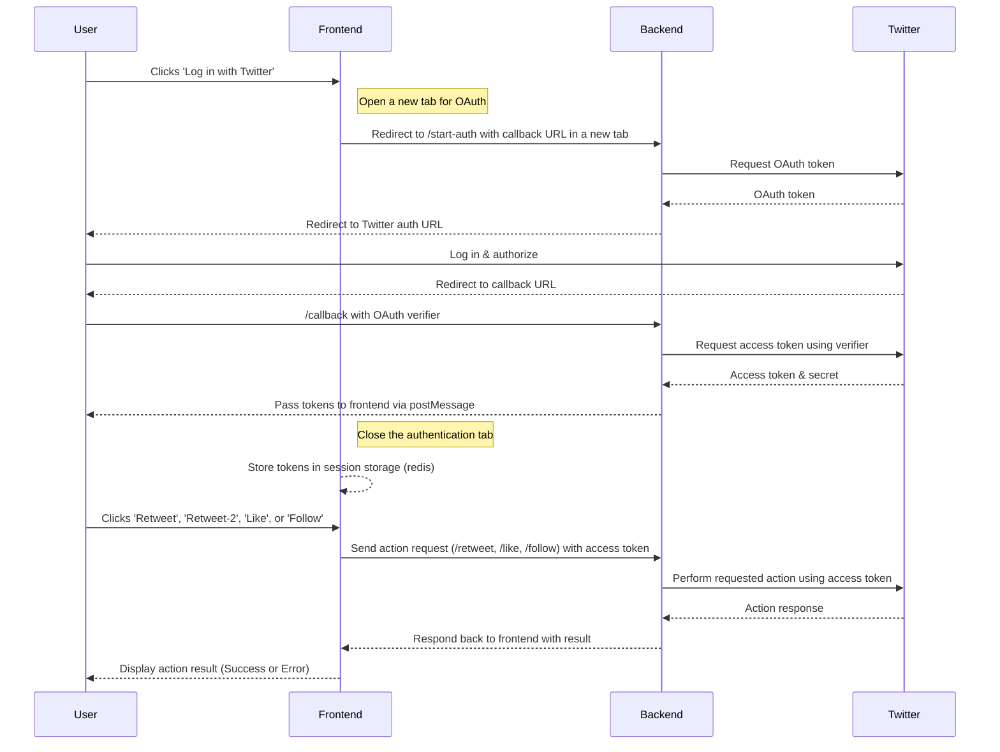
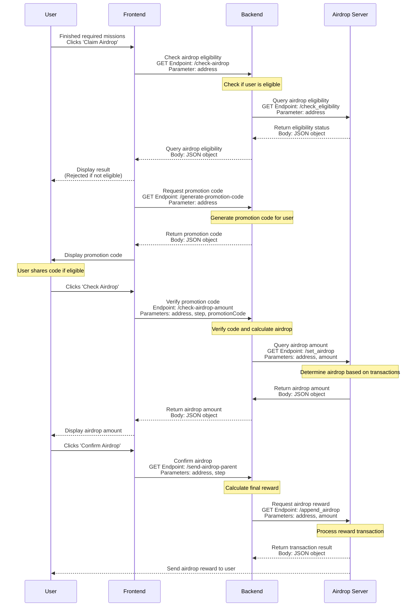

# Twitter OAuth Docker Project

[](https://github.com/BTI-US/Lotso-Twitter-Auth/actions/workflows/docker-ci.yml)
[](https://github.com/BTI-US/Lotso-Twitter-Auth/actions/workflows/codeql.yml)
[](https://opensource.org/licenses/MIT)

- Last Modified: 2024-04-26
- Author: Phill Weston

## Table of Contents

- [Overview](#overview)
- [Features](#features)
- [Requirements](#requirements)
- [Diagram](#diagram)
  - [Explanation of the Diagram](#explanation-of-the-diagram)
  - [Additional Details](#additional-details)
- [Installation and Setup](#installation-and-setup)
   - [Setting Up Twitter API Keys](#setting-up-twitter-api-keys)
   - [Building the Docker Image](#building-the-docker-image)
   - [Building the MongoDB Docker Image](#building-the-mongodb-docker-image)
   - [Building the Redis Docker Image](#building-the-redis-docker-image)
- [Running the Application](#running-the-application)
- [How to Acquire Twitter API Keys](#how-to-acquire-twitter-api-keys)
   - [User Authentication Settings](#user-authentication-settings)
- [Usage](#usage)
- [Testing](#testing)
- [Contributing](#contributing)
- [Milestones](#milestones)
- [License](#license)

## Overview
This project implements a serverless function hosted within a Docker container to facilitate the OAuth authentication of Twitter users and enable interaction with Twitter's API directly from the frontend. The application allows users not only to check their tweets but also to engage with them by performing actions such as retweeting, liking, and sharing directly through the application.

## Features
- OAuth authentication with Twitter.
- Fetching tweets from authenticated user's timeline.
- Checking if any tweet contains specified content.

## Requirements
- [Node.js](https://nodejs.org/)
- [Docker](https://www.docker.com/)
- Twitter Developer Account and API keys (Consumer Keys Only).

## Diagram

### Twitter OAuth Sequence Diagram



### Airdrop Sequence Diagram



### Explanation of the Twitter OAuth Diagram

- **User (U)**: The end-user interacting with the frontend.
- **Frontend (F)**: Your web application's frontend that interacts with the user and the backend.
- **Backend (B)**: The server-side component that handles OAuth with Twitter, fetching tweets, and analyzing content.
- **Twitter (T)**: The Twitter platform that handles OAuth and provides access to user tweets.

### Steps for Twitter OAuth (Frontend)

1. **User Action**: The user clicks 'Log in with Twitter' on the frontend.
2. **OAuth Start**: The frontend opens a new tab redirecting the user to the backend `/start-auth` endpoint with the callback URL.
3. **OAuth Token Request**: The backend requests an OAuth token from Twitter.
4. **Twitter Response**: Twitter returns an OAuth token to the backend.
5. **User Redirect to Twitter**: The backend redirects the user to the Twitter authentication URL in the newly opened tab.
6. **User Authorizes**: The user logs into Twitter and authorizes the application.
7. **Callback to Backend**: Twitter redirects the user back to the specified callback URL on the backend, providing an OAuth verifier.
8. **Access Token Request**: The backend requests an access token from Twitter using the verifier.
9. **Twitter Provides Tokens**: Twitter sends the access token and secret back to the backend.
10. **Token Passing**: The backend passes the tokens to the frontend via `postMessage`, and the popup window is closed.
11. **Token Storage**: The frontend securely stores the tokens in session storage.
12. **User Actions**: The user performs actions such as 'Retweet', 'Like', or 'Share' via the frontend interface.
13. **Action Requests**: The frontend sends requests to the backend to perform the selected actions using the stored access tokens.
14. **Twitter Action Execution**: The backend makes API calls to Twitter to execute the actions (retweet, like, share).
15. **Display Results**: The frontend displays the results of the actions to the user (success or failure).

### Steps for Airdrop Sequence Diagram

1. **User Action**: The user completes the required missions and clicks 'Claim Airdrop' on the frontend.
2. **Eligibility Check**: The frontend sends a GET request to the backend `/check-airdrop` endpoint with the user's address as a parameter.
3. **Backend Processing**: The backend checks if the user is eligible for the airdrop.
4. **Airdrop Server Query**: The backend sends a GET request to the Airdrop Server `/check_eligibility` endpoint with the user's address as a parameter.
5. **Eligibility Status**: The Airdrop Server returns the eligibility status to the backend, which then forwards it to the frontend.
6. **Display Result**: The frontend displays the result to the user. If the user is not eligible, the process ends here.
7. **Promotion Code Request**: If the user is eligible, the frontend sends a GET request to the backend `/generate-promotion-code` endpoint with the user's address as a parameter.
8. **Promotion Code Generation**: The backend generates a promotion code for the user and returns it to the frontend.
9. **Display Promotion Code**: The frontend displays the promotion code to the user.
10. **User Shares Code**: If the user is eligible, they share the promotion code.
11. **Airdrop Verification**: The user clicks 'Check Airdrop', and the frontend sends a request to the backend `/check-airdrop-amount` endpoint with the user's address, step, and promotion code as parameters.
12. **Airdrop Calculation**: The backend verifies the promotion code and calculates the airdrop amount.
13. **Airdrop Amount Query**: The backend sends a GET request to the Airdrop Server `/set_airdrop` endpoint with the user's address and calculated airdrop amount as parameters.
14. **Airdrop Determination**: The Airdrop Server determines the airdrop amount based on the user's transactions and returns it to the backend.
15. **Display Airdrop Amount**: The backend returns the airdrop amount to the frontend, which then displays it to the user.
16. **Airdrop Confirmation**: The user clicks 'Confirm Airdrop', and the frontend sends a GET request to the backend `/send-airdrop-parent` endpoint with the user's address and step as parameters.
17. **Final Reward Calculation**: The backend calculates the final reward.
18. **Airdrop Reward Request**: The backend sends a GET request to the Airdrop Server `/append_airdrop` endpoint with the user's address and final reward amount as parameters.
19. **Reward Transaction Processing**: The Airdrop Server processes the reward transaction and returns the transaction result to the backend.
20. **Airdrop Reward Delivery**: The Airdrop Server sends the airdrop reward to the user.

### Additional Details

- **Secure Token Handling**: The tokens are never exposed directly in the frontend code or stored insecurely. They are only transmitted using secure methods and stored temporarily as needed for making API requests.
- **User Interaction and Experience**: The use of a popup window for OAuth ensures that the user does not navigate away from the original application, improving the user experience by keeping the context intact.
- **Action Specificity**: By specifying that the user can perform actions such as retweeting, liking, and sharing directly after authentication, the steps reflect a more interactive and dynamic use of the Twitter API.
- **Backend and Frontend Roles**: The delineation between backend and frontend responsibilities is made clear, emphasizing security and efficient data handling.

## Installation and Setup

### Setting Up Twitter API Keys

1. Create a Twitter Developer account and an application to obtain your API keys.
2. Set your `TWITTER_CONSUMER_KEY` and `TWITTER_CONSUMER_SECRET` as environment variables or securely store them for use in the application.

### Building the Docker Image

1. Clone the repository:
   ```bash
   git clone https://github.com/BTI-US/Lotso-Twitter-Auth
   cd Lotso-Twitter-Auth
   ```
2. Build the Docker image:
   ```bash
   docker build -t twitter-auth .
   ```

### Building the MongoDB Docker Image

1. Pull the MongoDB image:
   ```bash
   docker pull mongo
   ```
2. Run the docker image with the necessary environment variables:
   ```bash
   docker run --name mongodb -d -p 27017:27017 -v /root/mongodb:/data/db -e MONGO_INITDB_ROOT_USERNAME=admin -e MONGO_INITDB_ROOT_PASSWORD=password mongo
   ```

### Building the Redis Docker Image

1. Pull the Redis image:
   ```bash
   docker pull redis
   ```
2. Run the docker image with the necessary environment variables:
   ```bash
   docker run --name redis -d -p 6379:6379 redis
   ```

### Setting the docker network

We need to create a docker network to allow the containers to communicate with each other. Run the following command:
```bash
docker network create lotso-network
```

## Running the Application

Run the Docker container using the following command:
```bash
SERVER_PORT=5000 \
MONGODB_DB=twitterLogs \
MONGODB_USERDB=twitterUsers \
MONGODB_PORT=27017 \
MONGODB_USERNAME=admin \
MONGODB_PASSWORD='your_mongodb_password' \
TWITTER_CONSUMER_KEY='your_twitter_consumer_key' \
TWITTER_CONSUMER_SECRET='your_twitter_consumer_secret' \
CERT_PATH=/etc/ssl/certs/fullchain2.pem \
PRIVKEY_PATH=/etc/ssl/certs/privkey2.pem \
HOST_CERT_FOLDER=/etc/letsencrypt/archive/btiplatform.com \
CONTAINER_CERT_FOLDER=/etc/ssl/certs \
REDIS_PORT=6000 \
AIRDROP_SERVER_PORT=8081 \
AIRDROP_PER_STEP=50000 \
AIRDROP_REWARD_AMOUNT=10000 \
LOTSO_PURCHASED_USER_AMOUNT=300000 \
WEBPAGE_ADDRESS=https://lotso.org \
AUTH_WEB_ADDRESS=https://oauth.btiplatform.com \
docker-compose up -d
```

To remove the Docker container, run:
```bash
SERVER_PORT=5000 \
MONGODB_DB=twitterLogs \
MONGODB_USERDB=twitterUsers \
MONGODB_PORT=27017 \
MONGODB_USERNAME=admin \
MONGODB_PASSWORD='your_mongodb_password' \
TWITTER_CONSUMER_KEY='your_twitter_consumer_key' \
TWITTER_CONSUMER_SECRET='your_twitter_consumer_secret' \
CERT_PATH=/etc/ssl/certs/fullchain2.pem \
PRIVKEY_PATH=/etc/ssl/certs/privkey2.pem \
HOST_CERT_FOLDER=/etc/letsencrypt/archive/btiplatform.com \
CONTAINER_CERT_FOLDER=/etc/ssl/certs \
REDIS_PORT=6000 \
AIRDROP_SERVER_PORT=8081 \
AIRDROP_PER_STEP=50000 \
AIRDROP_REWARD_AMOUNT=10000 \
LOTSO_PURCHASED_USER_AMOUNT=300000 \
WEBPAGE_ADDRESS=https://lotso.org \
AUTH_WEB_ADDRESS=https://oauth.btiplatform.com \
docker-compose down
```

## How to Acquire Twitter API Keys

1. Go to the [Twitter Developer Portal](https://developer.twitter.com/en/portal/dashboard).
2. Click on 'Projects & Apps' and then 'Overview'.
3. Click on 'Create App'.
4. Fill in the required details and create the app.
5. Go to the 'Keys and Tokens' tab.
6. Copy the 'API Key' and 'API Secret Key' and use them as your `TWITTER_CONSUMER_KEY` and `TWITTER_CONSUMER_SECRET`.

## Twitter API Rate Limitations

Refer to the [Twitter API Rate Limiting](https://developer.twitter.com/en/docs/twitter-api/rate-limits) documentation for details on the rate limits for different endpoints.

### User Authentication Settings

1. Click the 'Edit' button in the 'User Authentication Settings' section.
2. In the `App permission` field, select 'Read and write'.
3. In the `Type of App` field, select 'Web App, Automated App or Bot'.
4. In the `App info` field, set the `Callback URL / Redirect URL` to `https://oauth.btiplatform.com/twitter-callback`, and set the `Website URL` to `https://lotso.org`.
5. Click 'Save'.

## Usage

The application has the following endpoints:
- `/start-auth`: Initiates the OAuth process.
- `/twitter-callback`: Handles the callback from Twitter and exchanges the request token for an access token.
- `/retweet`: Retweets a specific tweet.
- `/like`: Likes a specific tweet.
- `/bookmark`: Bookmarks a specific tweet.
- `/follow-us`: Follows a specific user.
- `/check-auth-status`: Checks if the user is authenticated.
- `/check-retweet`: Checks if a tweet has been retweeted by the user.
- `/check-like`: Checks if a tweet has been liked by the user.
- `/check-follow`: Checks if a user is following the specified account.
- `/check-bookmark`: Checks if a tweet has been bookmarked by the user.
- `/check-airdrop`: Checks if user has claimed an airdrop.
- `/log-airdrop`: Logs the airdrop claim.
- `/check-airdrop-amount`: Checks the amount of airdrop available for the user.
- `/generate-promotion-code`: Generates a promotion code for the user.
- `/send-airdrop-parent`: Sends an airdrop to the parent user for rewards.
- `/subscription-info`: Fetches the subscription information for the user.

Refer to the [API Documentation](https://github.com/BTI-US/Lotso-Twitter-Auth/wiki/REST_API_Endpoints) for detailed information on each endpoint.

## Milestones

- [x] Implement OAuth with Twitter.
- [x] Basic functionality to interact with Twitter API.
- [x] Use MongoDB to log each user's actions.

## License

This project is licensed under the MIT License - see the [LICENSE](LICENSE) file for details.